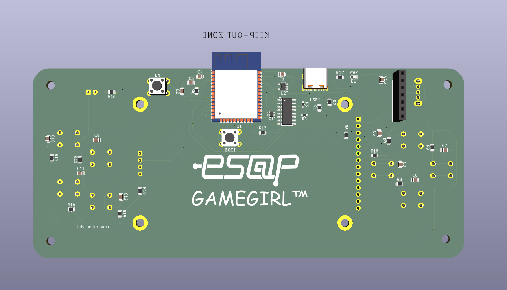
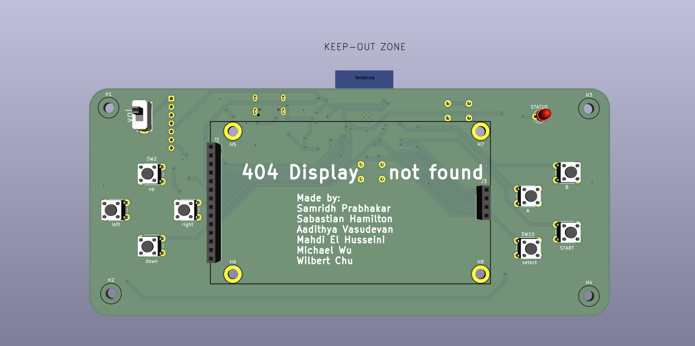

# ESAP Tetris

A complete, feature-packed Tetris game implementation for the ESP32 microcontroller featuring a custom PCB design, real-time graphics rendering on an ILI9341 SPI TFT display, I2S audio playback, SD card asset loading, and FreeRTOS multi-core task scheduling.

---

## 📸 PCB Design

The project features a custom-designed PCB tailored for handheld gameplay with optimized power delivery, hardware debouncing, and an auto-programming USB-C interface.

### Board Renders

| Front View (Component Side) | Back View (Controls & Silk) |
| :---: | :---: |
|  |  |

### Key Hardware & Schematic Highlights

- **Microcontroller**: ESP32-WROOM-32 module (32-bit dual-core Xtensa @ 240 MHz, 520 KB SRAM, Wi-Fi/BT).
- **USB-C Interface & Auto-Flashing**: Integrated `CH340C` USB-to-UART converter with dual NPN auto-reset circuitry (`MUN5211DW1`) for seamless hands-free code uploads via USB Type-C.
- **Power Management**: `AP2112K-3.3` LDO regulator supplying up to 600mA at 3.3V with dedicated ground plane thermal heat sinking. USB Type-C `CC1`/`CC2` 5.1kΩ pull-down resistors for 5V C-to-C charger support.
- **Display Connection**: Dedicated 14-pin socket header for 2.8" ILI9341 SPI TFT Display (240×320 resolution) on the `VSPI` bus. Includes 10kΩ pull-up resistor on `CS` (`GPIO5`).
- **SD Card Storage**: 4-pin SPI socket header for MicroSD card module on the `HSPI` bus. Includes 10kΩ pull-up resistor on `CS` (`GPIO15`).
- **Input Controllers**: 8 tactile pushbuttons (UP, DOWN, LEFT, RIGHT, A, B, START, SELECT) with hardware RC debouncing filters (0.1µF capacitors) and 10kΩ pull-up resistors on input-only GPIOs (34, 35, 36, 39).
- **Audio & Volume Control**: Audio output header with an integrated slide switch (`SW12`) for hardware gain/volume control.

---

## 🛠️ Hardware Specifications & Pinout

### SPI Display Connection (VSPI)

| ESP32 Pin | Signal Name | Display Function |
| :--- | :--- | :--- |
| **GPIO 23** | `MOSI` | Serial Data Input |
| **GPIO 19** | `MISO` | Serial Data Output |
| **GPIO 18** | `SCK` | Serial Clock |
| **GPIO 5** | `CS` | Chip Select (10kΩ Pull-Up) |
| **GPIO 2** | `DC` | Data / Command Select |
| **GPIO 4** | `RST` | Reset |
| **3.3V** | `LED` | Display Backlight Power |

### MicroSD Card Connection (HSPI)

| ESP32 Pin | Signal Name | SD Card Function |
| :--- | :--- | :--- |
| **GPIO 13** | `MOSI` | Data Input |
| **GPIO 17** | `MISO` | Data Output |
| **GPIO 14** | `SCK` | Clock |
| **GPIO 15** | `CS` | Chip Select (10kΩ Pull-Up) |

### Game Control Buttons

| GPIO Pin | Function | Hardware Circuit |
| :--- | :--- | :--- |
| **GPIO 36 (VP)** | Left | 10kΩ Pull-Up + 0.1µF Debounce |
| **GPIO 39 (VN)** | Right | 10kΩ Pull-Up + 0.1µF Debounce |
| **GPIO 34** | Down | 10kΩ Pull-Up + 0.1µF Debounce |
| **GPIO 35** | Up / Rotate | 10kΩ Pull-Up + 0.1µF Debounce |
| **GPIO 32** | Button A | 10kΩ Pull-Up + 0.1µF Debounce |
| **GPIO 33** | Button B | 10kΩ Pull-Up + 0.1µF Debounce |
| **GPIO 27** | Start | 10kΩ Pull-Up + 0.1µF Debounce |
| **GPIO 16** | Select | 10kΩ Pull-Up + 0.1µF Debounce |

---

## 💻 Software Architecture

The software is structured as a **PlatformIO** project utilizing FreeRTOS multi-core task scheduling:

```
ESAP_Tetris/
├── PCB/                     # KiCad 10 PCB schematics, board layouts & gerbers
│   ├── pcb_front.png
│   └── pcb_back.png
├── include/                 # Header files
│   ├── main.hpp
│   ├── logic.h
│   ├── display.h
│   ├── audio.h
│   └── sdcard.h
├── src/                     # Source implementations
│   ├── main.cpp             # FreeRTOS task initialization & main loop
│   ├── logic.cpp            # Tetris game rules & state machine
│   ├── display.cpp          # TFT graphics rendering
│   ├── audio.cpp            # I2S audio decoding & streaming
│   └── sdcard.cpp           # SD card file system interface
├── platformio.ini           # PlatformIO configuration
└── README.md                # Project documentation
```

### FreeRTOS Dual-Core Task Allocation

- **Core 1 (Main Task)**: Executes input polling, Tetris game loop, piece rotation, line clear checks, level progression, and TFT rendering.
- **Core 0 (Audio Task)**: Manages SD card file buffering, WAV audio decoding, and continuous background music streaming via I2S DAC.

---

## 🚀 Building & Flashing

### Prerequisites
- **VS Code** with **PlatformIO IDE** extension installed.

### Steps
1. Clone the repository:
   ```bash
   git clone https://github.com/Samprab06/ESAP-Tetris.git
   cd ESAP-Tetris
   ```
2. Connect your ESP32 board via USB-C.
3. Build & Upload firmware using PlatformIO:
   ```bash
   pio run -t upload
   ```
4. Open the Serial Monitor:
   ```bash
   pio device monitor
   ```

---

## 👥 Credits & Team

**Designed and Built by:**
- Samridh Prabhakar
- Sabastian Hamilton
- Aadithya Vasudevan
- Mahdi El Husseini
- Michael Wu
- Wilbert Chu

---

## 📜 License

This project is open-source and provided for educational and personal use.
